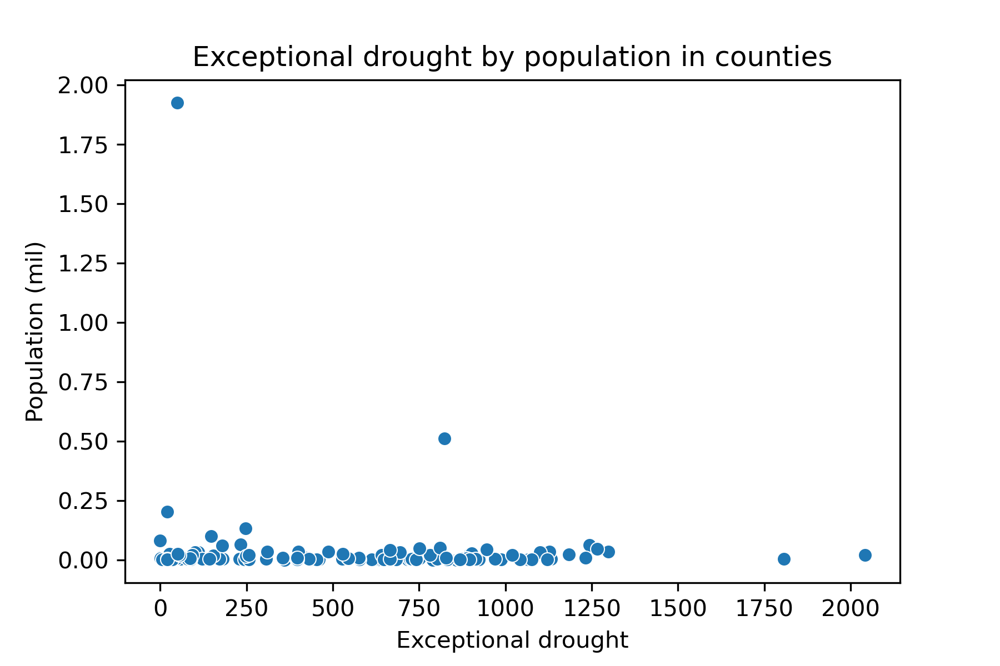

# EVOLUTION OF DROUGHT INTENSITY IN THE U.S.

# ABSTRACT
This project aims to analyze the evolution of drought intensity in the United States in recent years, specifically from 2010 onwards, to observe the impact of climate change through this phenomenon.
The sources of information used for the analysis come from official websites. These are: U.S. Drought Monitor (USDM), National Interagency Fire Center, and National Weather Service.
The comparative analysis considers the years 2010, 2015, 2020, 2022, and 2023. The unit of analysis considered is at the county level, considering all U.S. states that make up the continental area.
The evolution of the different drought intensities through the mentioned years, the proportions of the U.S. area under the different drought intensities considering the categories established in the USDM, the linkage between annual burned acres and extreme drought, the proportion of the population affected by this climatic anomaly are analyzed.
The results found corroborate the linkage between extreme drought and burned acres, verifying empirically among the consequences of drought, the negative impact on forest fires. Although it is observed that the worst year of the five analyzed is 2022, both in terms of extent and intensity of drought, there is no pattern of sustained behavior over time. In the years considered, there is an erratic behavior of this phenomenon, in the sense that it does not seem to be cumulative and it is changeable with respect to geographical location. This seems to hinder the design of a government policy at the federal level to prevent and mitigate its impact, mainly in terms of the design of a federal tax policy to repair or mitigate the damage caused by this phenomenon in the US continental area.

# INTRODUCTION 
Drought is a phase of climate cycle. However, the losses caused by drought are as severe as those caused by other weather events such as hurricanes, tornados, etc.
Drought affects flora and fauna, contributes to uncontrolled forest fires, causes damages to agriculture, affects domestic water supply, energy production, among other negative effects.
For this reason, monitoring of drought evolution is fundamental because its contribute to informing political decisions making and deciding a better targeting of governmental aid packages.
The sources of information used for the analysis were:
  - U.S. Drought Monitor 
  - National Interagency Fire Center
  - National Weather Service

Likewise, it is important to mention that according to the USDM, the different categories of droughts are classified according to their intensity:
  - D0: Abnormally dry
  - D1: Moderate Drought 
  - D2: Severe Drought 
  - D3: Extreme Drought 
  - D4: Exceptional Drought

# INPUT DATA
It is suggested that all the files used as inputs are in the same directory to facilitate the execution of the scripts, selecting as path the folder where these files are stored in the respective directory.
Four files with .csv extension, one file with .py extension, and one folder with shapefiles were used. These are:

## Script #1: drought.py
   - **cb_2019_us_state_500k.zip**: shapefiles with U.S. geospatial data at state boundaries from the U.S. Census Bureau.
   - **geotools.py**: this code fixes invalid geometries.
   - Drought shapefiles from U.S. Monitor Drought:
       - Year 2010: **USDM_20100427_M.zip**,
       - Year 2015: **USDM_20150428_M.zip**,
       - Year 2020: **USDM_20200428_M.zip**,
       - Year 2022: **USDM_20220426_M.zip**,
       - Date 04.04.2023: **USDM_20230404_M.zip**,
       - Date 04.11.2023: **USDM_20230411_M.zip**,
       - Date 04.18.2023: **USDM_20230418_M.zip**,
       - Date 04.25.2023: **USDM_20230425_M.zip**

## Script #2: regression.py
   - **db_reg.csv**: contains the data for the regression analysis. It contains two variables for the years 2000 to 2022. These are: annual wildfire acres (from the National Interagency Fire Center -NIFC, which collects annual wildfire statistics for federal and state agencies), and exceptional drought (D4) from the USDM.

## Script #3: drought_pop.py
   - **dm_export_20230425_20230425 tot area by county.csv**: this file comes from the U.S. Drought Monitor and provides drought information. It contains the following variables: MapDate, FIPS, County, State, None, D0, D1, D2, D3, D4, ValidStart, ValidEnd, and StatisticFormatID. The first refers to the date the data were captured. The second refers to the FIPS code; the third and fourth variables refer to the County and State names, respectively. The variables None, D0, D1, D2, D3, D4, to the areas of the counties in square miles affected by drought, where None refers to the square miles of the counties that are not affected by drought, and D0 to D4 to the square miles affected by drought depending on the different intensities according to the categories provided by the USDM. The rest of the variables are not significant for the analysis and refer to data validation dates and ID format.

## Script #4: share_pop.py
   - **county_geo.csv**: This file was provided in class. This file is extracted from the geographic information system (GIS) that provides basic physical data on the counties of the U.S. It contains five variables: "STATEFP", "COUNTYFP", "GEOID", "ALAND" and "AWATER". The first two correspond to the FIPS code, which results from the combination (concatenation) of the state code (2 digits) and the county code within the state (3 digits). The third variable, "GEOID", is a 5-digit FIPS code that uniquely identifies the county. The last two variables are the land and water areas of the county, measured in square meters.
  - **county_pop.csv**: This file was provided in class. It is obtained from the U.S. Census, and provides information about the population of counties. This file contains four variables: "NAME", "B01001_001E", "state", "county". The first is the name of the county, including its state. The second, "B01001_001E", is the census variable that gives the total population of the county. The third and fourth indicate the FIPS codes of the state and county within the state respectively.
  - **dm_export_20230425_20230425 tot area by county.csv:** see detail in Script 3.

# SCRIPTS 
The analysis was performed in Python version 3.9 (Spyder Anaconda3). The project contains 4 scripts to be executed as follows.

## 1._drought.py
### 1.1. Objective: 
This script seeks to have geographic dimension of the areas affected by droughts, according to different intensities, and to analyze their evolution in the years considered for the analysis, 2010, 2015, 2020, 2022, and 2023. It also seeks to identify the proportions or percentages of U.S. area accumulated under the different drought categories for the selected years.
### 1.2. Procedure: 
The file `cb_2019_us_state_500k.zip` is taken as input. Then the data are filtered to cut out the US geographic space corresponding to the continental area (conus), and the corresponding area is printed. 
The US maps are then plotted for the five selected years, 2010, 2015, 2020, 2022, and 2023, according to the different drought intensity categories established in the USDM.
The maps are colored according to the different drought intensities. A figure is also coded for the year 2022. Of the five years considered, 2022 is the worst in terms of drought extent and intensity. Therefore, the bar chart coded in this script is made for that particular year.
To prevent the script execution process from being interrupted due to invalid geometries, the script called **geotools.py**, a code that fixes invalid geometries, is used as a complement and should be executed as follows. First, download the file and save it in the repository as `geotools.py`. Then, add in the script the following line: **import geotools**. Then, after reading a layer that may have invalid geometries, it can be fixed by adding the following line, where gdf should be replaced by the name of the data frame: **geotools.make_valid(gdf)**
### 1.3. Output: 
The output of this script consists of the following three figures, `map2010-2022_US.png`, `map2023_US.png`, and `map2022_acum_US.png`.

## 2._regression.py
### 2.1. Objective: 
The objective of this script is to determine, using a linear regression model, the relationship between annual acres burned and the highest drought intensity category, exceptional drought, according to the categories established in the USDM.
### 2.2. Procedure:
This script presents a linear regression between annual wildfire acres as a dependent variable and exceptional drought (D4) as the explanatory or independient variable. The model is estimated with a constant.
First, the variables "acres" and "D4" were converted from string to numeric.
The model was estimated using the Ordinary Least Squares (OLS) method and the results were printed.
The units of measurement of the variables studied are converted. The annual wildfire variable, acres, is converted to millions, and the exceptional drought variable, D4, originally measured in square miles is converted to thousands of square miles. 
### 2.3. Output: 
The output of this script is a scatter plot with the estimated regression line, called `reg_US.png`.

## 3._drought_pop.py
### 3.1. Objective: 
The aim is to analyze the existing relationship between drought areas, considering the one with the highest intensity according to the categories established by the USDM, and the population corresponding to those areas in order to have knowledge about the population affected by the exceptional drought. 
### 3.2. Procedure:
Population data are obtained from the Census through its API. Then a merge is made of the population information with the information corresponding to the droughts, taking as a reference the date 04-25-2023 as it is the most updated data available at the time of elaboration of the project.
The variable taken as a key to join both databases is the FIPS (Federal Information Processing System Codes for States and Counties, code corresponding to the state and county in the census data). The left join is carried out by incorporating the population information in the drought file and the values are matched 1 to 1 in both databases. The matched data are counted and then the unnecessary columns are eliminated from the database.
The variables corresponding to the different degrees of drought are manipulated, eliminating the categories that are not used for the purposes of the analysis (including the variable "None" corresponding to the area in square miles not affected by the droughts) and the variable corresponding to the exceptional drought is converted from string to numeric, to operate with it in order to obtain the desired results.
Then, a scatter plot is used to visualize the relationship between exceptional drought and the population affected by it for each of the counties where this type of drought exists. 
Subsequently, a ranking is established to determine the five US counties most affected by exceptional drought, and the five counties that are the least affected by this type of drought. Similarly, the five most populated counties with exceptional drought and the five least populated counties with exceptional drought are established. 
The five counties with the largest area (in square miles) of exceptional drought and the five most populated counties with this drought category are visualized in separate bar charts, coded in this script. 
### 3.3. Output: 
The output consists of the following files and graphs: `pop_data.csv`, `Drought_by_population.csv`, `drought_pop_bycounties.png`, `Top5_pop.png`, and `Top5_drought.png`.

## 4._share_pop.py
### 4.1. Objective:
This script aims to analyze the relationship between the share of areas affected by droughts with respect to the total area of the county, and the population affected by those shares of drought areas. The unit of analysis considered is the county.
### 4.2. Procedure: 
Files provided in classes with county-level geographic information, `county_geo.csv`, and with county-level population information, `county_pop.csv`, were taken as inputs.
Both files were combined using a merge. The variable squares miles per county was generated by dividing the variable ALAND (square meters) present in the geodata file by the number in scientific notation 2.59e6. As a result, the square miles variable was obtained, which will be useful for later analysis. 
To perform the merge, the FIPS variable was used as a key join, and the resulting file was saved with the name `county_merged.csv`, with population and geographic information at the county level.
The information from the latter file (`county_merged.csv`) was then incorporated into the file corresponding to the drought information for the date 04.25.2023, `dm_export_20230425_20230425 tot area by county.csv`, by means of a left join. 
The FIPS variable was used as key join for the merge. A 1 to 1 matching was performed in both databases and a count of the matched units (counties) was generated, subsequently eliminating the unnecessary columns. The results of this procedure were saved in the file `Sh_drought_by_population.csv`.
The areas of most intense drought, severe drought (variable D2), extreme drought (D3), and exceptional drought (D4) were then filtered. They were converted from string to numeric format to be able to operate with them. 
A new dataframe was created with the subset of data relevant to the analysis and the joint share of these drought areas (severe, extreme and exceptional) in the total area of the county (squares miles) was computed for the selected date, 04.25.2023. Finally, the population affected by the share of these drought areas was calculated. 
These indicators were plotted on a scatter plot, where each point represents a county affected by the selected drought intensities. 
### 4.3. Output: 
The output of this script is `county_merged.csv`, `Sh_drought_by_population.csv`, and `sh_drought_pop_bycounties.png`.

# RESULTS

## Script #1: drought.py
### map2010-2022_US.png

This figure shows four maps of the U.S. colored according to different drought intensities for the years 2010, 2015, 2020, and 2022. 
As shown, the worst of these years is 2022, both in terms of extent and severity of drought. Drought areas are concentrated in the west, where the most intense droughts are also located, corresponding to the categories of severe drought (D2), extreme drought (D3), and exceptional drought (D4).
### map2023_US.png

This figure presents maps similar to those in the previous figure, but for the four weeks of April 2023, considering this information to be the most updated publicly available at the time the project was prepared. 
As can be seen, there is not much variation in the location or intensity of droughts throughout these four weeks of April 2023, mainly located in the center-south of the country. It is also observed that drought especially affects the state of Florida during this period, with a predominance of the severe category (D2).
### map2022_acum_US.png

This figure presents the cumulative area of the U.S. under drought in the year 2022, considered the worst in terms of drought among the years studied. As shown, approximately 64% of the continental U.S. area was under drought that year, with approximately 42% under severe, extreme, or exceptional drought conditions.

## Script #2: regression.py
### reg_US.png

This figure shows the relationship between annual wildfire acres and exceptional drought (D4) between 2000 and 2022. Each point in the figure represents a year and the straight line corresponds to the regression line fitted by the model. 
The dependent or explained variable is annual wildfire acres (measured in millions of acres), and the independent or explanatory variable is exceptional drought (D4) (in thousands of square miles). The model is estimated by the Ordinary Least Squares method, considering a constant for the estimation. 
It is observed that there is a positive correlation between annual wildfire acres and exceptional drought. This is formally corroborated by a positive estimated regression coefficient of the explanatory variable, statistically significant for a confidence level (alpha) of 10%.

## Script #3: drought_pop.py
The date April 25, 2023 was used for the analysis, as it is the latest available information published by the USDM at the date of preparation of this project.
### drought_pop_bycounties.png

As can be seen in the graph, where each point represents a county affected by the exceptional drought, there are some extreme values both in terms of population level (points farther away from the 0 value on the vertical axis) as well as outliers in terms of the extent of this drought category (points farther away from the 0 value on the horizontal axis). 
To find out which counties correspond to these extreme values, we proceeded to compute the following rankings: the five counties affected by exceptional drought with the highest population levels, and the five counties affected by the largest areas of exceptional drought, according to population levels. The results were as follows.
### top5_pop.png: Top 5 counties by population with exceptional drought

The result of this ranking is as follows:
Bexar County (Texas State): 1.92 million (mil) of inhabitants, Sedgwick County (Kansas State): 0.51 mil, Hays County (Texas State): 0.20 mil, Comal County (Texas State): 0.13 mil, Woodbury County (Iowa State): 0.10 mil.
### top5_drought.png: Top 5 counties with the highest areas of exceptional drought

The result of this ranking is as follows:
Texas County (Texas State): 2,041 square miles (0.02 million inhabitants), Beaver County (Oklahoma State): 1,806 square miles (0.005 mil inhabitants), Finney County (Kansas State): 1,298 square miles (0.04 mil), Osage County (Oklahoma State): 1,266 square miles (0.05 mil), Reno County (Kansas State): 1,243 square miles (0.06 mil inhabitants).
These results are also reflected in the second figure presented, which shows that the areas most affected by the exceptional drought during the last week of April 2023 were the states of Texas, Oklahoma and Kansas.

## Script #4: share_pop.py
### sh_drought_pop_bycounties.png

Again, as shown in the figure, there are several counties affected by severe or worse (extreme or exceptional) droughts with high percentages of population (the points farther from 0 on the vertical axis refer to the most populated counties within the relative shares of the geographic areas affected by severe or worse droughts).
Therefore, when designing public policies or governmental aid packages to assist these areas intensely affected by the drought phenomenon, among the relevant variables to consider, population density in these areas is one of them. 
As mentioned at the beginning of the project, drought is a climatic phenomenon that grows due to global warming, damaging flora, fauna, and human life, by negatively affecting water levels and air quality, indispensable factors for life in any of its forms. Therefore, its monitoring is essential for the early detection of drought areas and timely governmental decisions, avoiding irreparable effects such as the loss of biodiversity and human lives.

# REFERENCES AND LINKS TO DATA SOURCES
  - National Interagency Coordination Center (2022). Wildland Fire. Summary and Statistics. Annual Report 2022.
  - National Integrated Drought Information System (2018). Drought and Wildland Fire Nexus (NDAWN) Strategic Plan: 2018–2022.
  - Scasta D. J.; Weir R. J.; and Stambaugh C. M. (2016). Droughts and Wildfires in Western U.S. Rangelands. Society for Range Management, August 2016.
  - U.S. Department of Agriculture (2019). Effects of Drought on Forests and Rangelands in the United States: Translating Science Into Management Responses. United States Department of Agriculture, September 2019. 
  - National Interagency Fire Center: https://www.nifc.gov/fire-information/statistics 
  - U. S. Census Bureau. TIGER/Line Shapefiles (geographic spatial data): https://www2.census.gov/geo/tiger/GENZ2019/shp/
  - U.S. Drought Monitor: https://droughtmonitor.unl.edu/DmData/GISData.aspx

